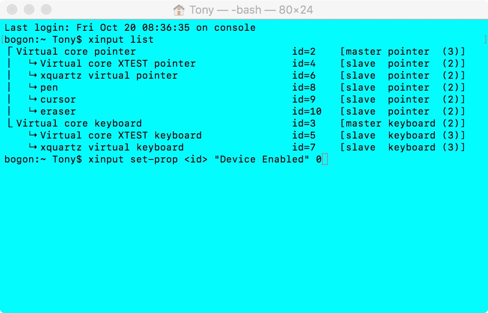

### ubuntu或Mac自动检测外接键鼠并禁用自带键盘触摸板脚本


有些人喜欢用外接键盘的时候把键盘放到把键盘放到笔记本上，避免键盘和触摸板的误操作，禁用鼠标键盘的方法：

```
bogon:~ pc$ xinput list


```




```
bogon:~ pc$ xinput set-prop <id> "Device Enabled" 0
# id is your pc's keyboard device id or touchpad device id

```

就OK了。

但是，懒惰是人类的天性，尤其是程序猿，每次开机都要敲这几行太麻烦了。何不写个开机自启脚本，检测到有外接键盘时自动禁用自带键盘。

```

#!/bin/bash

# 如果检测到有外接USB键盘鼠标则禁用笔记本键盘触摸板

SLEEP_TIME=5

# 自带的键盘触摸板名字 这里要用xinput list命令查看你的电脑自带键盘触摸板的名字
KEYBOARD_IN='AT Translated Set 2 keyboard'
MOUSE_IN='ETPS/2 Elantech Touchpad'

# 外接的键盘触摸板名字，同上插拔外接键鼠，并用xinput list命令确定你的外接键鼠的名字
USB_KEYBOARD_OUT='Logitech USB Keyboard'
USB_MOUSE_OUT='USB OPTICAL MOUSE'

while true
do
    # 处理键盘的逻辑
    HAVE_USB_KEYBOARD=`xinput list | grep "$USB_KEYBOARD_OUT"`
    if [ "" != "$HAVE_USB_KEYBOARD" ]; then
        if [ `xinput list-props "$KEYBOARD_IN" | grep "Device Enabled" | awk  -F ':' '{print $2}'` == 1 ]; then
            xinput set-prop "$KEYBOARD_IN" 'Device Enabled' 0
            # echo Disable keyboard
        fi
    else
        if [ `xinput list-props "$KEYBOARD_IN" | grep "Device Enabled" | awk  -F ':' '{print $2}'` == 0 ]; then
            xinput set-prop "$KEYBOARD_IN" 'Device Enabled' 1
            # echo Enable keyboard 
        fi
    fi

    # 处理键鼠标的逻辑
    HAVE_USB_MOUSE=`xinput list | grep "$USB_MOUSE_OUT"`
    if [ "" != "$HAVE_USB_MOUSE" ]; then
        if [ `xinput list-props "$MOUSE_IN" | grep "Device Enabled" | awk  -F ':' '{print $2}'` == 1 ]; then
            xinput set-prop "$MOUSE_IN" 'Device Enabled' 0
            # echo Disable Touchpad
        fi
    else
        if [ `xinput list-props "$MOUSE_IN" | grep "Device Enabled" | awk  -F ':' '{print $2}'` == 0 ]; then
            xinput set-prop "$MOUSE_IN" 'Device Enabled' 1
            # echo Enable Touchpad
        fi
    fi

    sleep $SLEEP_TIME
done

```

这样就可以了，测试OK后，放到~/.profile中即可登录自启。